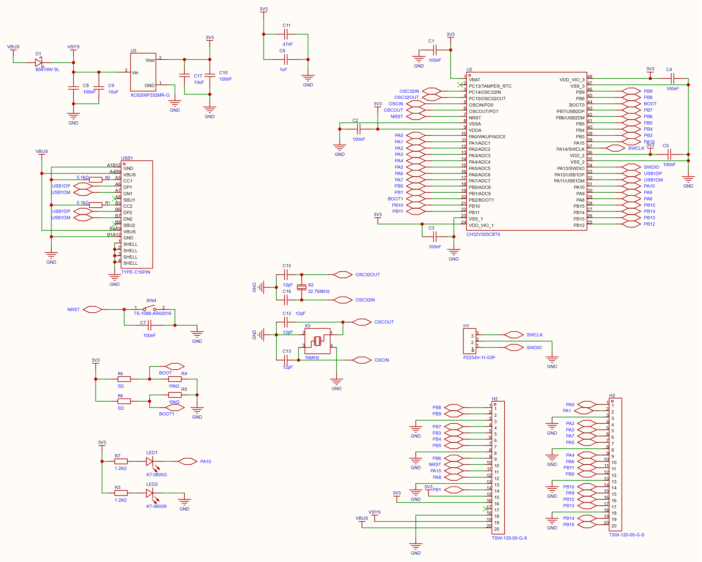
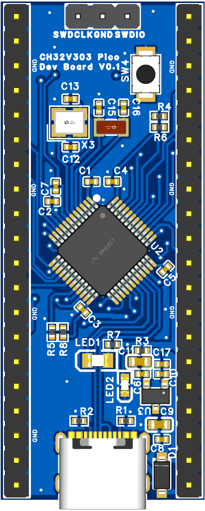
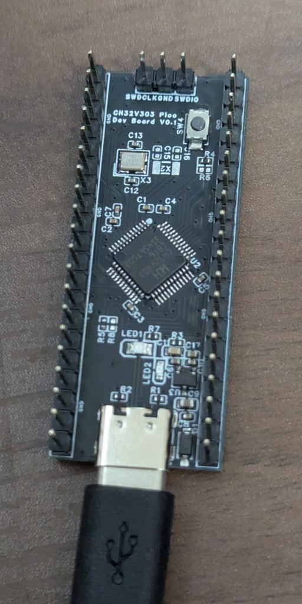

# CH32V303DevBoardPico

Raspberry Pi Pico と同じ外形・ピンヘッダ位置を保ちながら、**WCH CH32V303CBT6**（RISC-V / 144MHz / LQFP-48）を搭載した開発ボードです。
現状：裏返しスタッキングにより既存の Pico 互換拡張基板（CAN 拡張 + 24V 電源監視）にそのまま搭載可。

設計には **嘉立创EDA（EasyEDA Pro）** を使用しています。

## 概要

| 項目 | 内容 |
|---|---|
| MCU | CH32V303CBT6（LQFP-48 / RISC-V / 144MHz） |
| 基板サイズ | 21.0 × 51.3 mm（Raspberry Pi Pico 互換外形） |
| レイヤー | 2層 |
| 電源 | USB Type-C 5V 入力 → 3.3V LDO |
| クロック | HSE 16MHz クリスタル |
| デバッグ | SWD（H1: SWDIO / GND / SWCLK の3ピン） |

## 構成 V0.1

## 製造データ（`output/v0_1/`）

| ファイル | 内容 |
|---|---|
| `Gerber.zip` | Gerber / ドリルデータ |
| `BOM.xlsx` | 部品表 |
| `PickAndPlace.xlsx` | SMT 実装座標 |
| `Schematic.pdf` / `.svg` / `.png` | 回路図 |
| `3D_PCB.png` | PCB 3D レンダリング |

発注先：JLCPCB（ Gerber.zip + BOM/PickAndPlace は JLCPCB SMT の形式に対応）

## V0.1 実機動作確認

2026-09-03に実装基板で以下を確認しました。

| 項目 | 結果 |
|---|---|
| 電源 | VBUS / VSYS / 3V3の電圧、電源LED、異常発熱なしを確認 |
| SWD / Flash | WCH-LinkEからCH32V303CBT6を認識し、書き込み・読戻し一致・リセット後および電源再投入後の自動起動を確認 |
| クロック | 16MHz HSEからPLLで144MHz動作を確認（LSEは未実装のためOFF） |
| LED1 | PA10のActive Low出力で点滅を確認 |
| Pico互換ヘッダ | ヘッダへ配線された全26 GPIOでHigh / Low出力を実測確認 |
| USB Device | USB CDCとして列挙し、Host↔Device双方向通信、USB抜き差し後およびリセット後の再列挙を確認 |

## 既知の制限・注意事項

| # | 項目 | 重要度 | 対応 |
|---|---|---|---|
| 1 | 裏返しスタッキング時の物理干渉（部品高さ） | 高 | 実装前に実物確認、必要なら延長ヘッダ |
| 2 | 3V3_EN（拡張 pin37→H2-17）無接続 | 中 | 拡張基板側プルアップ有無を確認 |
| 3 | LSE 有効化時に X2 未実装のためハング | 低 | RTC 不使用またはタイムアウト処理 |
| 4 | シリアルブート不可（BOOT0=GND 固定） | 低 | SWD 書き込みで代替 |
| 5 | USB ESD 保護なし | 低 | 屋外使用・量産時は対策推奨 |

## ライセンス

[CC-BY-SA 4.0](https://creativecommons.org/licenses/by-sa/4.0/)